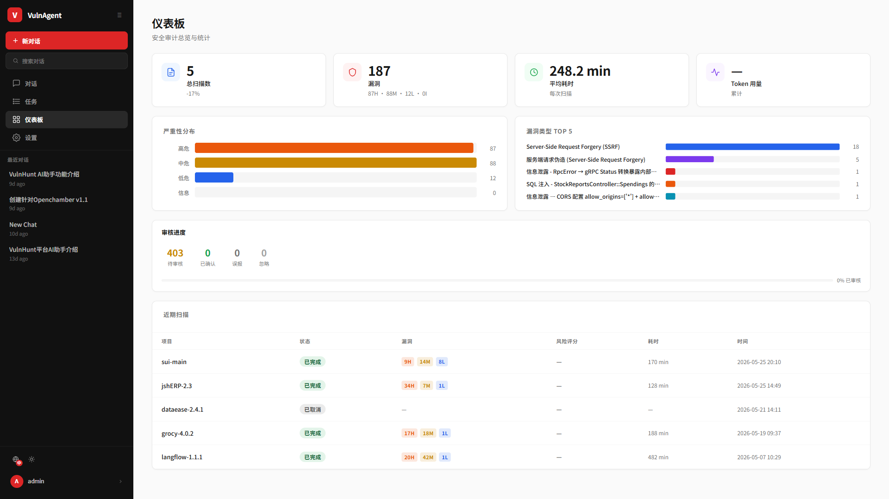
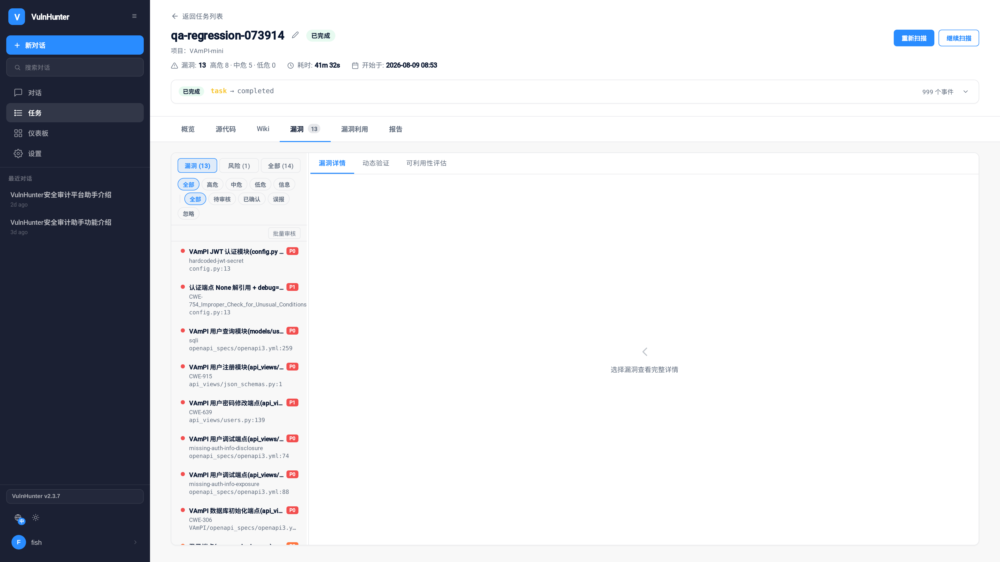
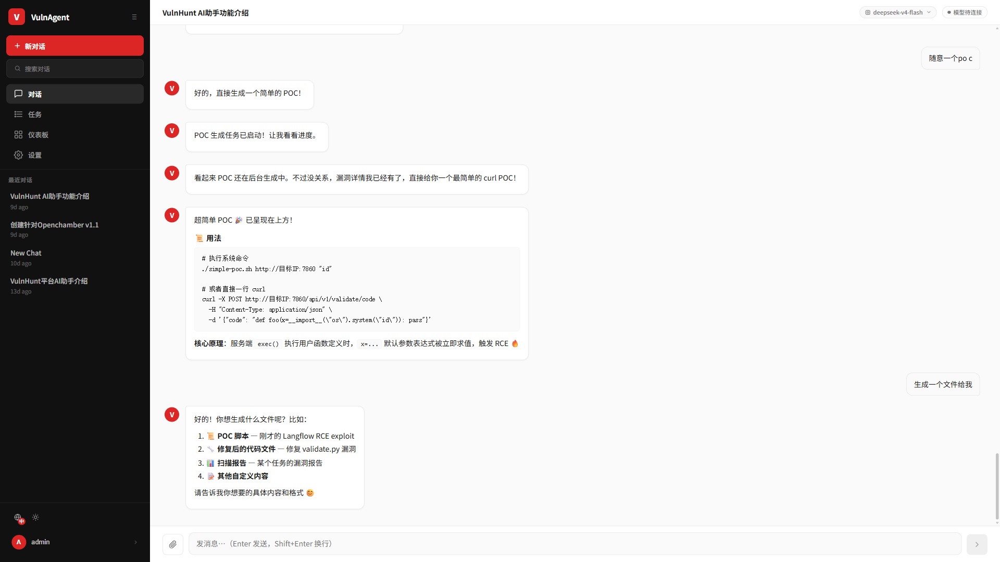
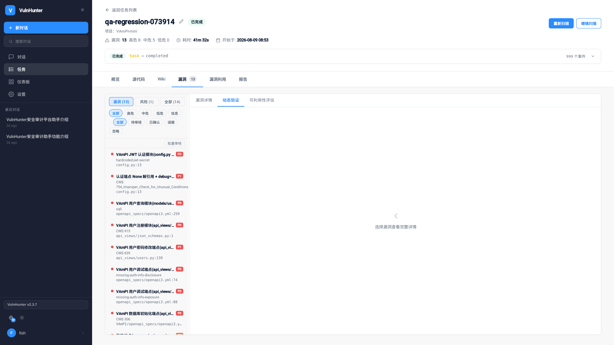
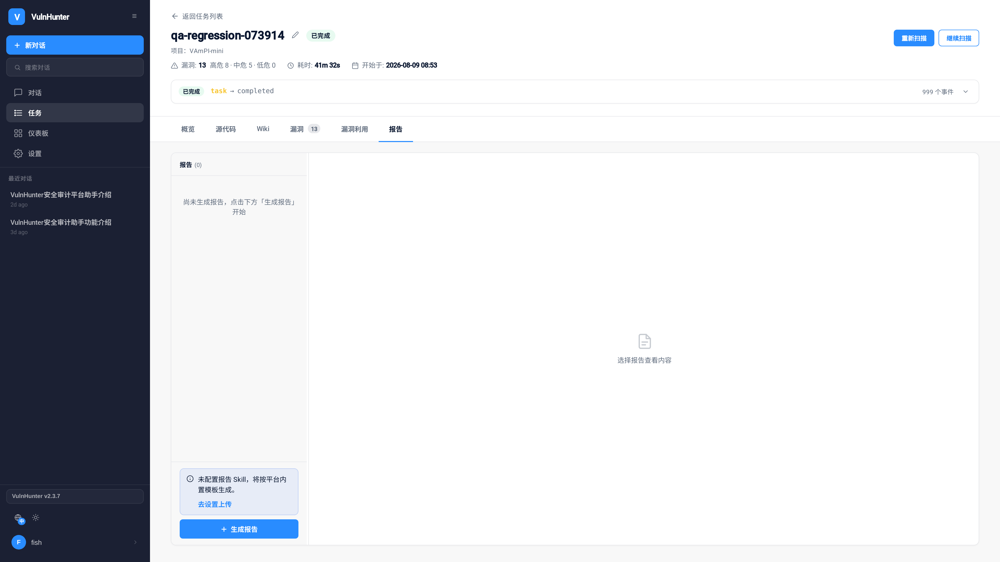

<p align="center">
  
</p>

<h1 align="center">VulnHunter</h1>

<p align="center">
  <strong>AI-Powered Automated Vulnerability Discovery Agent Platform</strong>
</p>

<p align="center">
  <a href="./LICENSE">
    
  </a>
  
  
  
</p>

<p align="center">
  English | <a href="./README_ZH.md">中文</a>
</p>

---

VulnHunter is an open-source AI vulnerability hunting workbench that combines automated target profiling, AI-assisted vulnerability discovery, chat-based investigation, POC/EXP generation and verification, review workflows, and report delivery — all in a self-hosted deployment.

---

## 📸 Screenshots

### 🎛️ Dashboard


_Real-time scan progress and security posture at a glance_

### 🔍 Vulnerability Findings


_AI-discovered vulnerabilities with per-finding review workflow_

### 🤖 AI Chat Assistant


_Conversational interface: query findings, operate tasks, generate reports_

### 💥 POC/EXP Verification


_One-click POC generation with automated verification_

### 📊 Audit Reports


_Professional report output with Markdown export_

---

## ⚡ Why VulnHunter?

| 😫 Traditional Approach | 💡 VulnHunter Solution |
|---|---|
| **Manual code audit is slow** — can't keep up with code iteration | **🤖 AI Agent automation** — YoungFlow orchestrates multi-agent collaboration |
| **High false positives** — traditional SAST lacks semantic understanding | **🧠 Context-aware analysis** — AI combines code semantics and business logic |
| **Can't confirm exploitability** — no way to know if a finding is real | **💥 Automated POC verification** — generates and executes POC to confirm impact |
| **Scattered results** — reports, POCs, communication across multiple tools | **🏠 Unified workbench** — scanning, Chat, POC, reports, and review in one platform |
| **Steep learning curve** — need to master multiple security tools | **💬 Conversational ops** — natural language interaction through Chat |

---

## 🎯 Feature Matrix

| Feature | Description |
|---------|-------------|
| 🔍 **AI Vulnerability Discovery** | YoungFlow agent orchestration for automated target analysis and vulnerability detection |
| 💬 **Chat AI Assistant** | 16+ MCP tools — query findings, operate tasks, switch models via conversation |
| 💥 **POC/EXP Generation** | AI-generated POC/EXP paths with dynamic verification when sandbox is configured |
| 📊 **Audit Reports** | YoungFlow-orchestrated professional Markdown report generation |
| ✅ **Finding Review** | Per-finding and bulk review workflow with 4-state management |
| 📋 **Task Management** | Full lifecycle: create, pause, cancel, resume, re-run |
| 🎛️ **Dashboard** | Real-time statistics, severity distribution, review progress tracking |
| 🔐 **Credential Management** | Multi-model credential configuration, runtime switching, availability diagnostics |
| 🐳 **Containerized Deployment** | Docker Compose one-click deployment, isolated worker containers |

### Edition Comparison

| Feature | Community (Open Source) | Enterprise |
|---------|:-:|:-:|
| All features above | ✅ | ✅ |
| Single user | ✅ | ✅ |
| Multi-user RBAC | ❌ | ✅ |
| License activation | Free, no activation | ✅ |
| Support | Community | Dedicated |

---

## 🏗️ Architecture

```text
┌─────────────────────────────────────────────────────┐
│                  Browser (React/Vite)                │
└──────────────────────┬──────────────────────────────┘
                       │
┌──────────────────────▼──────────────────────────────┐
│        VulnHunter Service (Hono + WebSocket + MCP)    │
│                                                      │
│  ┌──────────┐  ┌──────────┐  ┌──────────────────┐  │
│  │ Tasks    │  │ Chat     │  │ Reports/POC      │  │
│  │ Findings │  │ AI Agent │  │ Review Workflow   │  │
│  └──────────┘  └──────────┘  └──────────────────┘  │
└───┬────────────────┬────────────────┬───────────────┘
    │                │                │
    ▼                ▼                ▼
┌────────┐   ┌────────────┐   ┌───────────────────┐
│PostgreSQL│  │   MinIO    │   │ Docker Workers    │
│Tasks     │  │Files       │   │ ┌───────────────┐ │
│Findings  │  │Reports     │   │ │ YoungFlow Scan│ │
│Users     │  │Sources     │   │ │ Chat Worker   │ │
│Settings  │  │Artifacts   │   │ │ Report Worker │ │
└────────┘   └────────────┘   │ │ POC/Eval      │ │
                               │ └───────────────┘ │
                               └───────────────────┘
```

**Packages**:

```text
packages/
├── shared/           Shared API types and contracts
├── service/          Core backend service
├── web/              React frontend
├── worker-bridge/    Worker-side bridge for chat/report modes
└── enterprise/       Commercial add-ons (BSL 1.1)
```

---

## 🚀 Quick Start

### Requirements

- Linux host (Ubuntu 22.04+ recommended)
- Docker + Docker Compose
- 8GB+ RAM

### Docker Compose Deployment

```bash
# Clone
git clone https://github.com/user/VulnHunter.git
cd VulnHunter

# Configure
cp deploy/.env.example .env
# Edit .env: set passwords, ports, data directory, etc.

# Start
docker compose -f deploy/docker-compose.yml --env-file .env up -d
```

Open `http://localhost:23000` and create your admin account on the bootstrap page.

### Development

```bash
pnpm install
pnpm build
pnpm test

# Start infrastructure only
docker compose -f deploy/docker-compose.yml --env-file deploy/.env.example up -d db minio
```

---

## ⚙️ Configuration

See `deploy/.env.example` for all options. Common settings:

| Variable | Description | Default |
|----------|-------------|---------|
| `WEB_PORT` | Web UI port | `23000` |
| `DATA_DIR` | Persistent data directory | `/opt/vulnhunter/data` |
| `DOCKER_SUBNET` | Docker bridge subnet | `10.177.0.0/24` |
| `VULNHUNTER_MASTER_KEY_FILE` | Credential encryption key path | — |
| `WORKER_IMAGE` | Scan worker image | `vulnhunter-worker:latest` |
| `EDITION` | Edition mode | `community` |

---

## 📜 Licensing

This project uses an **open-core** model:

- **Community / open-source core** (this repository): [VulnHunter License](./LICENSE) — **Apache License 2.0** with additional conditions (no unauthorized hosted SaaS/managed service; retain VulnHunter branding on UIs derived from this repo). See also [NOTICE](./NOTICE).
- **Enterprise / SaaS** (`packages/enterprise/` and private packages): [proprietary commercial license](./packages/enterprise/LICENSE) — not BSL; no automatic conversion date.

---

## 🤝 Contributing

Contributions are welcome! The detailed contribution guide is being finalized. For now:

1. Open an issue describing the bug, feature, or documentation improvement.
2. Fork and develop — keep changes focused.
3. Run `pnpm build && pnpm test` before submitting.
4. Open a Pull Request.

**Do not submit**: secrets, private scan data, customer data, or generated runtime artifacts.

---

## ⚠️ Security and lawful-use notice

VulnHunter is a tool for **security research and authorized testing**.

You may use it **only** against systems, codebases, and services that you **own** or that you are **explicitly authorized** to test.

You must **not** use this software to:
- scan, penetrate, or attack systems without authorization;
- discover or exploit vulnerabilities for any unlawful purpose;
- damage third-party systems, steal data, extort, or disrupt service.

By using this software you acknowledge that **you alone** are responsible for any consequences of unauthorized or illegal use; project maintainers are not liable for such misuse.

If you find a security issue **in the VulnHunter platform itself**, report it **privately** per [SECURITY.md](./SECURITY.md). Do not file a public issue that exposes exploit details.

---

<p align="center">
  <sub>Built with ❤️ for the security research community</sub>
</p>

---

## Contributing & security

- Contributing guide and CLA: [CONTRIBUTING.md](./CONTRIBUTING.md) · [CLA.md](./CLA.md)
- Private vulnerability reports: [SECURITY.md](./SECURITY.md)
- License: [VulnHunter License](./LICENSE) · [NOTICE](./NOTICE)

