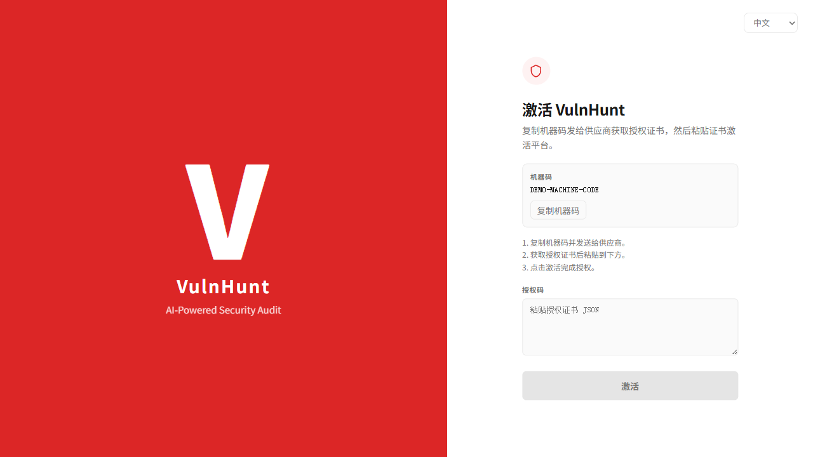
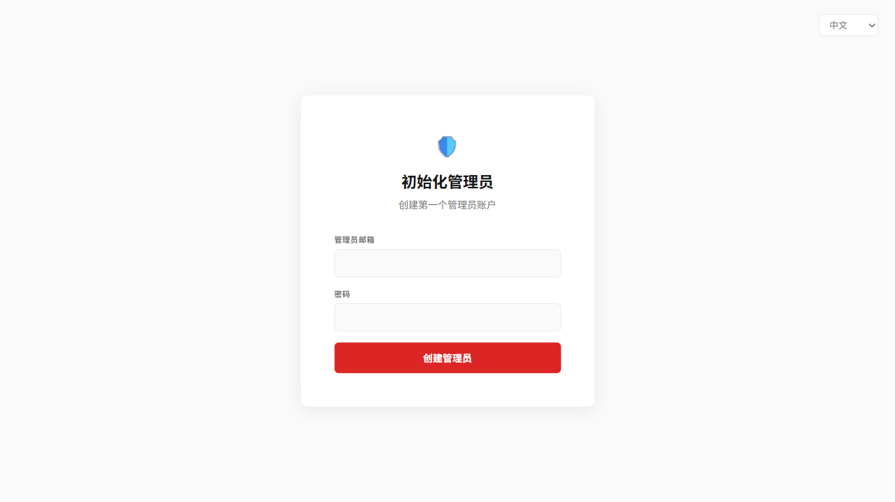
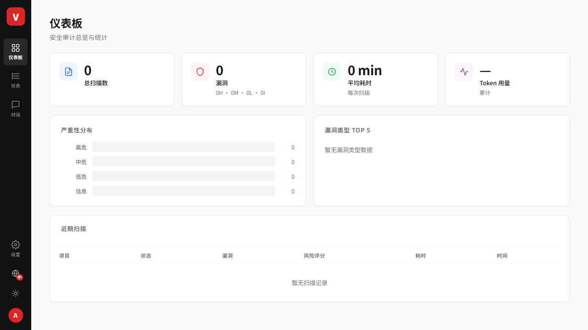
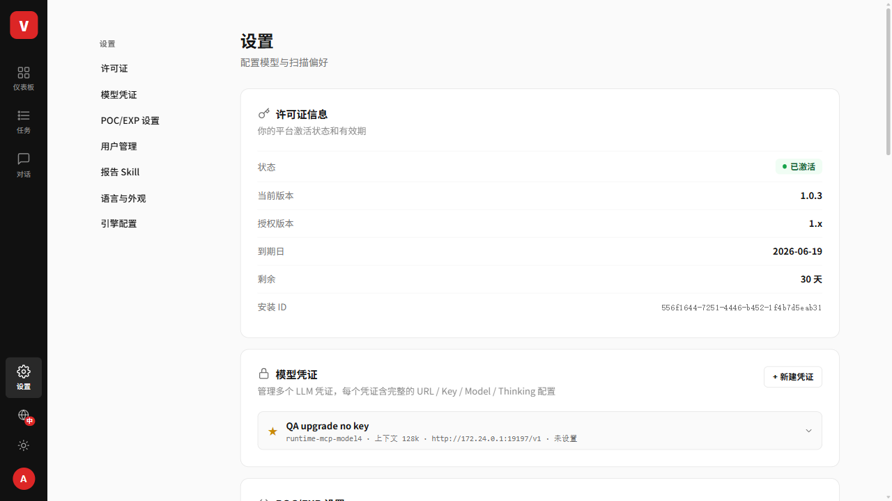
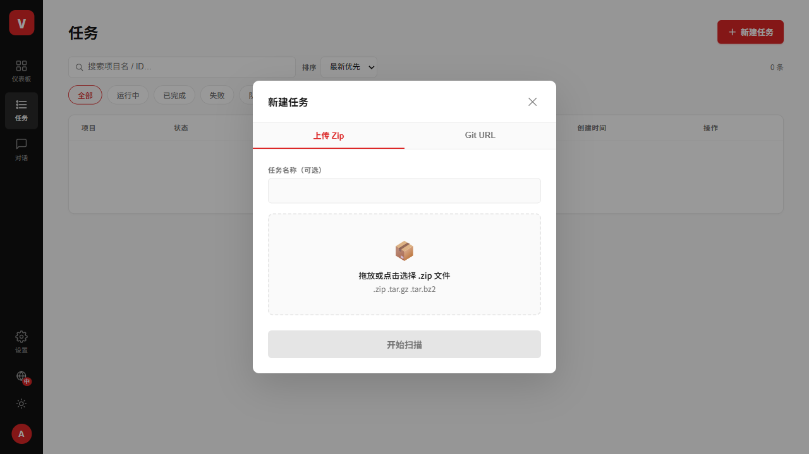
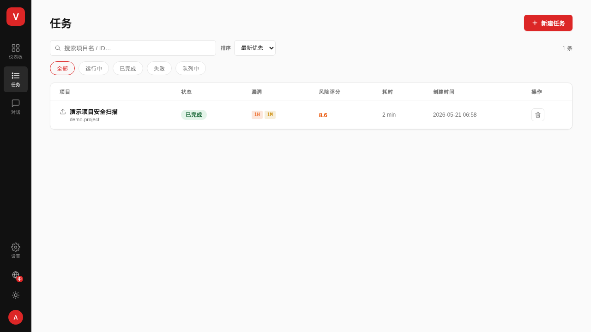
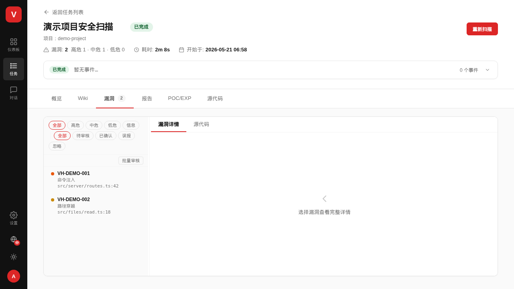
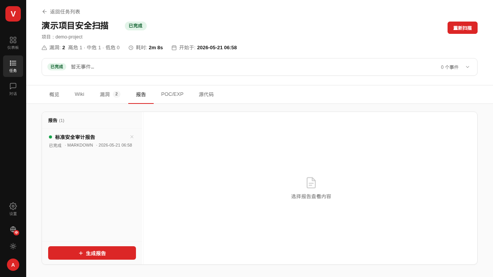

# VulnAgent 1.0.4 离线部署与基础操作帮助手册

本文用于离线环境中的平台部署、初始化和基础操作。安装包为离线包，沿用一键 `install.sh`，安装后按本文完成 License 激活、管理员初始化、模型配置、创建扫描任务和查看结果。

## 1. 部署前准备

服务器要求：

- Linux x86_64
- Docker Engine + Docker Compose v2，或 legacy `docker-compose`
- 当前用户可执行 `docker ps`
- 建议内存 ≥ 32GB，磁盘可用空间 ≥ 100GB
- 可访问模型服务地址（公网 API 或内网自托管模型）

检查命令：

```bash
docker --version
docker compose version || docker-compose version
docker ps
free -h
df -h
```

## 2. 校验并解压离线包

```bash
sha256sum -c vulnagent-release-1.0.4.tar.gz.sha256
tar -xzf vulnagent-release-1.0.4.tar.gz
cd vulnagent-release-1.0.4
```

离线包内应包含：

- `images/*.tar`：VulnAgent、Postgres、MinIO 离线 Docker 镜像
- `install.sh` / `doctor.sh` / `upgrade.sh` / `uninstall.sh`
- `docker-compose.yml` / `.env.example`
- `VERSION.json` / `checksums.sha256`
- `docs/`：Markdown + HTML 部署文档和截图

## 3. 一键安装

推荐使用持久化绝对路径作为数据目录：

```bash
DATA_DIR=/opt/vulnagent/data WEB_PORT=23000 ./install.sh
```

普通用户部署可使用当前用户可写目录：

```bash
DATA_DIR=$HOME/vulnagent-data WEB_PORT=23000 ./install.sh
```

交互式终端中也可以直接运行：

```bash
./install.sh
```

安装脚本会自动生成 `.env`、生成 master key、校验文件、加载离线镜像、启动服务并等待 API 就绪。

## 4. 部署健康检查

```bash
./doctor.sh
```

全部通过后访问：

```text
http://<服务器IP>:23000
```

常用排障命令：

```bash
docker compose ps
docker compose logs -f service
docker compose logs -f web
```

## 5. 平台基础操作

### 5.1 License 激活

首次访问会进入激活页。复制机器码，向供应商申请授权证书，粘贴 License 后点击“激活”。



### 5.2 初始化管理员 / 登录

首次激活后创建第一个管理员账号。后续访问会进入登录页，使用管理员账号登录。



### 5.3 打开仪表板

登录成功后进入仪表板。这里可查看总扫描数、漏洞统计、Token 用量和近期扫描。



### 5.4 配置模型凭证并验证

进入“设置 → 模型凭证”，点击“新建凭证”，填写模型名称、API Base URL、模型 ID、API Key（自托管模型如允许可留空），保存后执行连接/运行时验证。模型不可用时扫描任务无法正常完成。



### 5.5 创建扫描任务

进入“任务 → 新建任务”。可上传 `.zip/.tar.gz/.tar.bz2` 源码包，或填写 Git URL。选择模型凭证后点击“开始扫描”。



### 5.6 查看任务状态

任务创建后会经历队列中、运行中、已完成/失败。任务列表会展示状态、漏洞数量、风险评分、耗时和创建时间。



### 5.7 查看漏洞结果

进入任务详情页的 Findings 标签页，可查看漏洞列表、严重性、文件位置、函数名、详情说明和修复建议。



### 5.8 查看报告

进入任务详情页的 Reports 标签页，可查看已生成报告、预览报告内容，并下载交付文件。报告生成依赖任务完成情况和模型服务可用性。



## 6. 升级与备份

升级前需备份：

- 整个 `DATA_DIR`
- `$DATA_DIR/.secrets/vulnagent-master.key`
- 安装目录下 `.env`

升级命令：

```bash
./upgrade.sh
./doctor.sh
```

master key 丢失后，已保存的模型凭证无法解密。不要删除或重新生成已有部署的 master key。

## 7. 卸载

停止服务但保留数据：

```bash
./uninstall.sh
```

停止服务并删除 compose volumes：

```bash
./uninstall.sh --purge
```

`--purge` 不会自动删除外部 `DATA_DIR`，如需彻底清理，需人工确认后删除。

## 8. 常见问题

### 端口被占用

修改 `.env` 中 `WEB_PORT` 后重启：

```bash
docker compose down
docker compose up -d
```

### Docker socket 权限错误

确认当前用户可执行：

```bash
docker ps
```

必要时将用户加入 `docker` 组并重新登录，然后重新运行 `./install.sh`。

### 授权失败

检查 License 是否完整、是否绑定当前机器码、是否过期、是否适配 VulnAgent 1.x。

### 模型验证失败

检查 API Base URL、模型 ID、API Key、网络连通性和模型服务限流策略。自托管模型如支持无 Key，可按现场模型服务要求留空。

## 9. 验收清单

- `sha256sum -c vulnagent-release-1.0.4.tar.gz.sha256` 通过
- `./install.sh` 成功完成
- `./doctor.sh` 全部通过
- Web 可访问
- License 激活成功
- 管理员初始化/登录成功
- 模型凭证可保存并通过验证
- 可创建扫描任务
- 可查看任务状态、漏洞结果和报告入口
